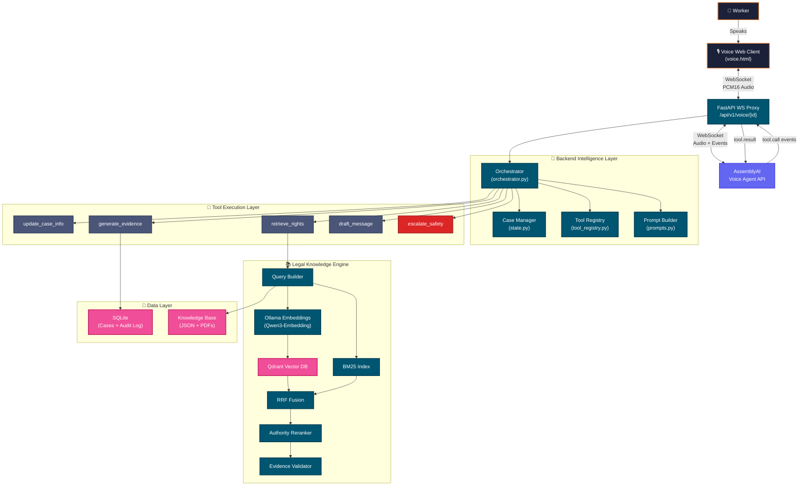
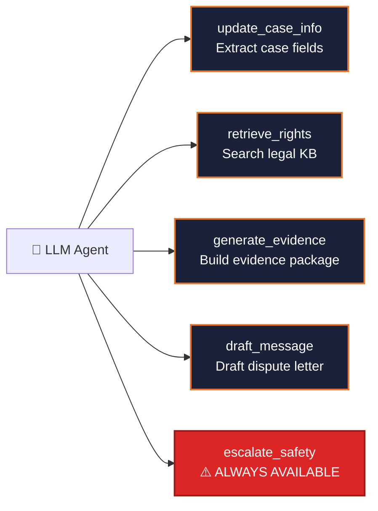
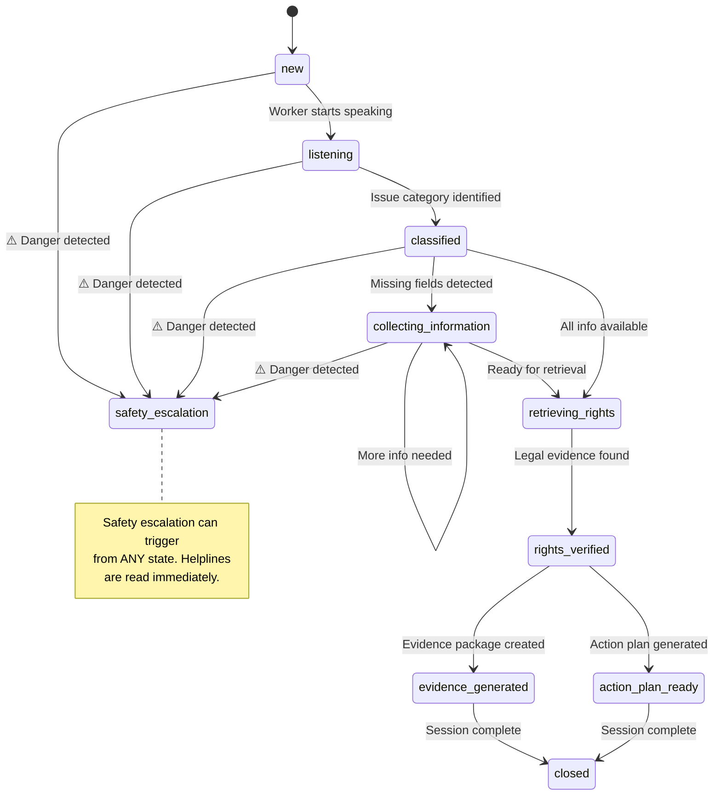

<div align="center">

<!-- Animated Header Banner -->


<br/>

<p>
  <strong>🇮🇳 An AI-powered voice agent empowering India's 450M+ informal & gig workers to navigate complex legal frameworks — entirely through natural, multilingual voice interaction.</strong>
</p>

<br/>

<!-- Badges Row 1 — Tech Stack -->
<p>
  
  
  
  
  
</p>

<!-- Badges Row 2 — Status -->
<p>
  
  
  
  
</p>

<!-- Quick Nav -->
<p>
  <a href="#-the-problem"><strong>Problem</strong></a> · 
  <a href="#-how-it-works"><strong>How It Works</strong></a> · 
  <a href="#-core-capabilities"><strong>Features</strong></a> · 
  <a href="#%EF%B8%8F-system-architecture"><strong>Architecture</strong></a> · 
  <a href="#-rag-pipeline-deep-dive"><strong>RAG Pipeline</strong></a> · 
  <a href="#-voice-agent-engine"><strong>Voice Engine</strong></a> ·
  <a href="#-quick-start"><strong>Quick Start</strong></a> · 
  <a href="#-api-reference"><strong>API</strong></a>
</p>

</div>

<br/>

---

<br/>

## 🎯 The Problem

<table>
  <tr>
    <td width="50%">
      <h3>The Reality of India's Informal Workforce</h3>
      <p>India's informal sector constitutes <strong>over 90% of the total workforce</strong> — roughly <strong>450 million</strong> people. These are the delivery riders, construction labourers, domestic helpers, and daily-wage earners who power the nation's economy.</p>
      <p>Despite strong legal protections under codes like the <em>Code on Wages 2019</em> and <em>OSH Code 2020</em>, the accessibility gap is <strong>massive</strong>:</p>
      <ul>
        <li>📖 <strong>Literacy barrier</strong> — Legal texts require 12th-grade reading comprehension</li>
        <li>🌐 <strong>Language barrier</strong> — Most legal resources exist only in English</li>
        <li>🔍 <strong>Information overload</strong> — Google returns conflicting, SEO-spammed legal advice</li>
        <li>❌ <strong>No actionability</strong> — Workers learn a law exists but don't know the next step</li>
      </ul>
    </td>
    <td width="50%">
      <h3>The WorkerSaathi Solution</h3>
      <p>WorkerSaathi is a <strong>zero-friction, voice-first AI agent</strong> that transforms how workers access legal knowledge:</p>
      <ul>
        <li>🎙️ <strong>Voice-native</strong> — Just tap and speak in Hindi, English, or Hinglish</li>
        <li>🛡️ <strong>Verified answers</strong> — RAG-grounded in curated Central Government legal codes</li>
        <li>📋 <strong>End-to-end resolution</strong> — From understanding rights to drafting formal grievance communications</li>
        <li>🚨 <strong>Safety-first</strong> — Automatic escalation for injuries, trafficking, and child labour</li>
        <li>🔒 <strong>Privacy-respecting</strong> — No audio logging, ephemeral sessions, zero PII collection</li>
      </ul>
      <br/>
      <blockquote>
        <p><em>"Main Swiggy mein delivery karta hoon. Mujhe 25 din se payment nahi mila..."</em></p>
        <p>→ WorkerSaathi classifies the issue, retrieves relevant law, and drafts a formal dispute letter — all through voice.</p>
      </blockquote>
    </td>
  </tr>
</table>

<br/>

---

<br/>

## 🔄 How It Works

> **A single voice interaction walks the worker through: problem intake → legal research → evidence packaging → actionable next steps.**

```
╔══════════════════════════════════════════════════════════════════════════════════╗
║                                                                                ║
║   👤 Worker speaks naturally        "Meri salary 2 mahine se nahi aayi"        ║
║         │                                                                      ║
║         ▼                                                                      ║
║   🎙️ AssemblyAI STT                Real-time Hindi/English/Hinglish → Text     ║
║         │                                                                      ║
║         ▼                                                                      ║
║   🧠 LLM Orchestrator              Extracts: worker_type, issue, employer...   ║
║         │                           Calls: update_case_info tool               ║
║         │                                                                      ║
║         ├──→ 📋 Case State Machine  Tracks all case fields, determines         ║
║         │                           what to ask next                           ║
║         │                                                                      ║
║         ├──→ 🔍 Hybrid RAG          Semantic + BM25 → RRF Fusion → Rerank     ║
║         │    └─ Qdrant Vector DB    Returns verified legal evidence            ║
║         │                                                                      ║
║         ├──→ 🛡️ Safety Guardrails   Detects danger → Emergency helplines       ║
║         │                                                                      ║
║         ├──→ 📦 Evidence Generator  Structured case package for complaints     ║
║         │                                                                      ║
║         └──→ ✉️ Message Drafter     Formal dispute letters to employers        ║
║                                                                                ║
║         ▼                                                                      ║
║   🔊 Text-to-Speech                Agent responds in worker's language         ║
║         │                                                                      ║
║         ▼                                                                      ║
║   👤 Worker hears actionable guidance                                          ║
║                                                                                ║
╚══════════════════════════════════════════════════════════════════════════════════╝
```

<br/>

---

<br/>

## ✨ Core Capabilities

<table>
  <tr>
    <td width="33%" align="center">
      <h3>🎙️ Multilingual Voice Agent</h3>
      <p>Real-time speech processing via <strong>AssemblyAI Universal-2</strong>. Handles seamless <strong>code-switching</strong> between Hindi, English, and Hinglish. Workers speak naturally — no forms, no typing.</p>
    </td>
    <td width="33%" align="center">
      <h3>🧠 Stateful Case Management</h3>
      <p>A deterministic <strong>finite state machine</strong> tracks every case through 11 distinct stages. Dynamically identifies <strong>missing fields</strong> and prompts the next question — one at a time, never overwhelming.</p>
    </td>
    <td width="33%" align="center">
      <h3>🔍 Hybrid RAG Engine</h3>
      <p><strong>Semantic search (Qdrant) + BM25 keyword search</strong>, fused via Reciprocal Rank Fusion. Authority reranking ensures primary legislation outranks FAQs. <strong>Zero hallucinations by design.</strong></p>
    </td>
  </tr>
  <tr>
    <td width="33%" align="center">
      <h3>🛡️ Safety-First Escalation</h3>
      <p>Mentions of <strong>injury, violence, trafficking, or child labour</strong> instantly halt all flows. Verified government helpline numbers (112, 1098, 181) are read aloud before any legal discussion.</p>
    </td>
    <td width="33%" align="center">
      <h3>📋 Evidence Structuring</h3>
      <p>Transforms unstructured voice narratives into <strong>timeline-based evidence packages</strong> with legal backing — ready for submission to Labour Commissioner or DLSA.</p>
    </td>
    <td width="33%" align="center">
      <h3>✉️ Message Drafting</h3>
      <p>Generates <strong>professional, legally-sound communication templates</strong> tailored to the specific platform (Swiggy, Zomato, Urban Company) for formal dispute initiation.</p>
    </td>
  </tr>
</table>

<br/>

---

<br/>

## 🏗️ System Architecture

WorkerSaathi is built as a modular, event-driven system with clear separation between voice transport, AI orchestration, and legal knowledge retrieval.



### Architecture Highlights

| Layer | Technology | Purpose |
|-------|-----------|---------|
| **Voice Transport** | AssemblyAI Universal-2 | Real-time STT/TTS with tool-calling over WebSocket |
| **Web Interface** | Single-file HTML/CSS/JS | Zero-dependency voice client with waveform animations |
| **API Gateway** | FastAPI + Uvicorn (ASGI) | Async HTTP/WS server with auto-generated Swagger docs |
| **Orchestration** | Python + Pydantic | Deterministic tool dispatch with permission gating |
| **Vector Search** | Qdrant (on-disk/in-memory) | Dense embedding search with metadata filtering |
| **Keyword Search** | rank-bm25 | Sparse retrieval for exact legal section matching |
| **Embeddings** | Ollama + Qwen3-Embedding-8B | Local, private embedding generation — no data leaves your machine |
| **PDF Processing** | PyMuPDF | Extract and chunk legal documents from government PDFs |
| **Persistence** | SQLite | Case snapshots, audit trail, action plans, evidence items |

<br/>

---

<br/>

## 🔍 RAG Pipeline Deep Dive

> **The RAG pipeline is the brain behind WorkerSaathi's legal accuracy.** Unlike naive "stuff context" approaches, it uses a 7-stage pipeline that ensures every piece of legal information is verified, ranked, and validated before reaching the worker.

```
┌─────────────────────────────────────────────────────────────────────┐
│                    RAG Pipeline Architecture                         │
│                                                                     │
│  ┌─────────────┐     ┌──────────────┐     ┌─────────────────────┐  │
│  │  Knowledge   │     │   Chunker    │     │  Embedding Client   │  │
│  │  Base (JSON  │────▶│  (semantic   │────▶│  (Ollama / Qwen3-   │  │
│  │  + PDFs)     │     │   chunks)    │     │   Embedding-8B)     │  │
│  └─────────────┘     └──────────────┘     └─────────┬───────────┘  │
│                                                       │              │
│  ┌────────────────────────────────────────────────────▼───────────┐  │
│  │                   Hybrid Search Stage                           │  │
│  │  ┌─────────────────┐          ┌─────────────────┐              │  │
│  │  │  Qdrant Dense   │          │   BM25 Sparse   │              │  │
│  │  │  Search         │          │   Search        │              │  │
│  │  │  (semantic)     │          │   (keywords)    │              │  │
│  │  └────────┬────────┘          └────────┬────────┘              │  │
│  │           │          ┌──────────┐      │                       │  │
│  │           └─────────▶│ RRF (k=  │◀─────┘                       │  │
│  │                      │  60)     │                               │  │
│  │                      └────┬─────┘                               │  │
│  └───────────────────────────┼────────────────────────────────────┘  │
│                              │                                       │
│  ┌───────────────────────────▼────────────────────────────────────┐  │
│  │              Post-Retrieval Pipeline                            │  │
│  │  ┌─────────────┐  ┌────────────┐  ┌─────────────────────────┐ │  │
│  │  │  Authority   │─▶│  Evidence  │─▶│  Evidence Assembler     │ │  │
│  │  │  Reranker    │  │  Validator │  │  (LegalEvidence output) │ │  │
│  │  └─────────────┘  └────────────┘  └─────────────────────────┘ │  │
│  └────────────────────────────────────────────────────────────────┘  │
└─────────────────────────────────────────────────────────────────────┘
```

### Pipeline Stages Explained

| # | Stage | Module | What It Does |
|---|-------|--------|-------------|
| 1 | **Data Ingestion** | `loader.py` + `pdf_loader.py` | Loads JSON research packages and government PDFs from `knowledge/workersaathi/` |
| 2 | **Semantic Chunking** | `chunker.py` | Splits documents while preserving legal context (section headers with clauses) |
| 3 | **Embedding Generation** | `embeddings.py` | Generates dense vectors via **Ollama** (Qwen3-Embedding-8B), optimized for local inference |
| 4 | **Query Building** | `query_builder.py` | Expands the user's query with worker type and issue-specific terms; generates structured `RetrievalQuery` |
| 5 | **Hybrid Search** | `retriever.py` | Runs **Qdrant dense search** and **BM25 sparse search** in parallel, merges via **Reciprocal Rank Fusion (k=60)** |
| 6 | **Authority Reranking** | `reranker.py` | Boosts primary legislation (Acts/Codes) over secondary sources (FAQs/Blogs); applies worker-type and issue specificity scores |
| 7 | **Validation & Assembly** | `validator.py` + `evidence.py` | Checks legal status, detects known gaps and conflicts, adds jurisdiction limitations, and produces the final `LegalEvidence` object |

### Coverage Detection

The pipeline explicitly tracks what it **doesn't know**:

| Coverage Level | Meaning | Agent Behavior |
|---------------|---------|---------------|
| `FULL` | Verified evidence found | Present findings with source citations |
| `PARTIAL` | Some evidence, known gaps | Present what's found, state missing info |
| `GAP` | No verified info available | Honestly tell the worker; recommend legal aid |
| `CONFLICT` | Sources contradict each other | Present both sides; recommend professional |
| `NONE` | No relevant results | Suggest consulting labour office |

<br/>

---

<br/>

## 🎙️ Voice Agent Engine

WorkerSaathi's voice system operates in two modes, both powered by the same Orchestrator:

### Mode 1: Browser-Based (WebSocket Proxy)

```
Browser ←→ FastAPI WS (/api/v1/voice/{session_id}) ←→ AssemblyAI
               ↕
          Orchestrator
         (server-side tool execution)
```

The browser sends raw PCM16 audio. FastAPI proxies to AssemblyAI, **intercepts `tool.call` events**, executes them via the Orchestrator, and sends `tool.result` back — keeping the API key and all business logic server-side.

### Mode 2: Direct Microphone (CLI)

```bash
python app/main.py --voice
```

Connects your microphone directly to AssemblyAI via WebSocket. Uses PyAudio for local audio capture and playback. **Requires headphones** to prevent acoustic echo.

### Tool-Calling Protocol

The voice agent uses **5 backend tools** — the LLM decides when to call them based on conversation context:



| Tool | When Called | Status Gates |
|------|-----------|-------------|
| `update_case_info` | Worker reveals any case information | `new` → `collecting_information` |
| `retrieve_rights` | Enough info gathered to search legal KB | `classified` → `rights_verified` |
| `generate_evidence` | Worker wants to file a complaint | `rights_verified` + |
| `draft_message` | Worker wants to contact employer | `rights_verified` + |
| `escalate_safety` | Any mention of danger/injury/trafficking | **ALL statuses** (overrides everything) |

<br/>

---

<br/>

## 🗣️ Voice Interaction Scenarios

Test WorkerSaathi's stateful reasoning with these real-world scenarios:

<table>
  <tr>
    <td width="5%" align="center">🛵</td>
    <td width="25%"><strong>Scenario A</strong><br/><em>Wage Theft (Hindi)</em></td>
    <td width="35%"><code>"Main Swiggy mein delivery karta hoon Mumbai mein. Mujhe pichle 25 din se 8000 rupaye ka payment nahi mila."</code></td>
    <td width="35%"><strong>→</strong> Classifies as <code>unpaid_wages</code> + <code>gig_worker</code>. Triggers RAG for gig worker payment protections under Code on Wages 2019. Generates formal dispute draft addressed to Swiggy.</td>
  </tr>
  <tr>
    <td width="5%" align="center">🏗️</td>
    <td width="25%"><strong>Scenario B</strong><br/><em>Safety Trigger (English)</em></td>
    <td width="35%"><code>"The scaffolding broke on the 4th floor. My leg is severely injured and the contractor refuses to pay for the hospital."</code></td>
    <td width="35%"><strong>→</strong> Detects <code>workplace_injury</code>. <strong>Immediately calls <code>escalate_safety</code></strong> — reads emergency helplines (112, 108) before any legal discussion. Then retrieves OSH Code compensation provisions.</td>
  </tr>
  <tr>
    <td width="5%" align="center">📵</td>
    <td width="25%"><strong>Scenario C</strong><br/><em>Deactivation (Hinglish)</em></td>
    <td width="35%"><code>"Mera Zomato partner account achanak deactivate ho gaya. Unhone koi reason nahi diya."</code></td>
    <td width="35%"><strong>→</strong> Classifies as <code>platform_deactivation</code>. Asks clarifying questions about tenure and last payment. Provides evidence collection checklist. Notes known <strong>knowledge gap</strong> in Central reinstatement procedures for gig workers.</td>
  </tr>
</table>

<br/>

---

<br/>

## 📋 Case State Machine

Every conversation follows a deterministic state machine — the LLM proposes actions, but the **backend** controls transitions:



### Case Fields Tracked

| Field | Type | Extracted From |
|-------|------|---------------|
| `worker_type` | Enum | `gig_worker`, `construction_worker`, `domestic_worker`, `factory_worker`, `other` |
| `issue_category` | Enum | `unpaid_wages`, `workplace_injury`, `platform_deactivation` |
| `state` | Enum | All 28 Indian states + 8 UTs (with fuzzy matching: "Mumbai" → Maharashtra) |
| `platform_or_employer` | String | "Swiggy", "Zomato", contractor name, etc. |
| `amount` | String | Pending amount (Hindi numerals auto-converted: "20 hazaar" → "20000") |
| `payment_pending_duration` | String | "2 months", "25 days" |
| `incident_date` | String | "pichle hafte" → "approximately 1 week ago" |
| `injury_details` | String | Free-text injury description |
| `deactivation_reason` | String | "no reason", "low rating", etc. |

<br/>

---

<br/>

## 🚀 Quick Start

### Prerequisites

| Requirement | Version | Purpose |
|------------|---------|---------|
| **Python** | 3.10+ | Runtime |
| **AssemblyAI API Key** | — | Voice Agent API (Universal-2 access required) |
| **Ollama** | Latest | Local embedding generation (Qwen3-Embedding-8B) |
| **Audio I/O** | — | Microphone + headphones (for CLI mode) |

### 1️⃣ Clone & Setup

```bash
# Clone the repository
git clone https://github.com/Aaditya210905/worker-rights-navigator.git
cd worker-rights-navigator

# Create isolated Python environment
python -m venv venv

# Activate (Windows)
venv\Scripts\activate
# Activate (Unix/macOS)
source venv/bin/activate

# Install all dependencies
pip install -r requirements.txt
```

### 2️⃣ Configure Environment

```bash
cp .env.example .env
```

Edit `.env`:
```env
# AssemblyAI — Required for voice features
ASSEMBLYAI_API_KEY=your_production_key_here

# Application
APP_ENV=development
APP_PORT=8000
APP_HOST=0.0.0.0
```

### 3️⃣ Prepare Knowledge Base (Optional)

If you want to rebuild the legal knowledge index:

```bash
# Install Ollama and pull the embedding model
ollama pull qwen3-embedding:8b

# Run the full knowledge pipeline
python -m app.rag.pipeline --index

# Verify retrieval quality
python -m app.rag.pipeline --test
```

### 4️⃣ Launch

<table>
  <tr>
    <td width="50%">
      <h4>🌐 Web Server (Recommended)</h4>

```bash
uvicorn app.main:app --reload
```

**Access:**
| Interface | URL |
|-----------|-----|
| 🎙️ Voice Client | [http://127.0.0.1:8000/voice](http://127.0.0.1:8000/voice) |
| 📖 Swagger Docs | [http://127.0.0.1:8000/docs](http://127.0.0.1:8000/docs) |
| ❤️ Health Check | [http://127.0.0.1:8000/api/v1/health](http://127.0.0.1:8000/api/v1/health) |

</td>
<td width="50%">
  <h4>🎙️ Direct Microphone (CLI)</h4>

```bash
python app/main.py --voice
```

> ⚠️ **Use headphones** to prevent acoustic echo feedback!

Connects your microphone directly to AssemblyAI. Speaks and listens in real-time. Press `Ctrl+C` to stop.

</td>
  </tr>
</table>

<br/>

---

<br/>

## 🌐 API Reference

WorkerSaathi exposes a fully documented REST + WebSocket API. Interactive docs available at `/docs`.

### 📡 Session & Case Management

| Method | Endpoint | Description |
|--------|----------|-------------|
| `POST` | `/api/v1/sessions` | Create a new conversation session. Returns session ID, case ID, initial prompt, and available tools. |
| `GET` | `/api/v1/sessions` | List all active sessions with summaries. |
| `GET` | `/api/v1/sessions/{id}` | Full session details including case state, available tools, and system prompt. |
| `DELETE` | `/api/v1/sessions/{id}` | Terminate session and clean up state. |
| `GET` | `/api/v1/sessions/{id}/case` | Current JSON case state with all filled fields. |
| `GET` | `/api/v1/sessions/{id}/case/missing-fields` | Missing fields, next question, and retrieval readiness. |
| `GET` | `/api/v1/sessions/{id}/case/context` | Current LLM system prompt with case context. |

### 🔧 Tool Execution

| Method | Endpoint | Description |
|--------|----------|-------------|
| `POST` | `/api/v1/sessions/{id}/tools/{tool_name}` | Execute a tool (same interface the voice agent uses). Body: `{ "arguments": { ... } }` |
| `POST` | `/api/v1/sessions/{id}/transcript` | Log a user transcript line. Body: `{ "text": "..." }` |

### 📚 Knowledge Base

| Method | Endpoint | Description |
|--------|----------|-------------|
| `GET` | `/api/v1/knowledge/stats` | Knowledge base indexing statistics. |
| `POST` | `/api/v1/knowledge/search` | Manual RAG query execution. |

### 🔊 Real-Time Voice

| Protocol | Endpoint | Description |
|----------|----------|-------------|
| `WebSocket` | `/api/v1/voice/{session_id}` | Full-duplex audio proxy. Browser sends `input.audio` (base64 PCM16), receives all AssemblyAI events. Tool calls are intercepted and executed server-side. |

<br/>

---

<br/>

## 📁 Project Structure

```
worker-rights-navigator/
│
├── 📂 app/                          # Application source code
│   ├── __init__.py                  # Package metadata (v0.1.0)
│   ├── main.py                      # FastAPI entrypoint + CLI voice runner
│   ├── config.py                    # Pydantic settings from .env
│   │
│   ├── 📂 agent/                    # 🧠 AI Orchestration Layer
│   │   ├── orchestrator.py          # Central tool dispatcher (611 LOC)
│   │   ├── prompts.py               # System prompt with dynamic case injection
│   │   ├── classifier.py            # LLM-based entity extraction schemas
│   │   ├── tool_registry.py         # Tool definitions + permission matrix
│   │   ├── conversation.py          # Conversation state tracking
│   │   ├── test_orchestrator.py     # Orchestrator unit tests
│   │   └── test_scenarios.py        # End-to-end scenario simulations
│   │
│   ├── 📂 api/                      # 🌐 Transport Layer
│   │   ├── routes.py                # RESTful API endpoints (240 LOC)
│   │   ├── ws.py                    # WebSocket voice proxy (228 LOC)
│   │   ├── schemas.py               # Pydantic request/response models
│   │   ├── session.py               # In-memory session manager
│   │   └── knowledge.py             # Knowledge base API endpoints
│   │
│   ├── 📂 case/                     # 📋 State Management
│   │   ├── models.py                # Enums (WorkerType, IssueCategory, 36 IndianStates)
│   │   ├── state.py                 # CaseManager with field tracking + next-question logic
│   │   └── fields.py                # Field definitions and validation
│   │
│   ├── 📂 rag/                      # 📚 Legal Knowledge Engine (15 modules)
│   │   ├── pipeline.py              # End-to-end data pipeline runner
│   │   ├── loader.py                # JSON research package loader
│   │   ├── pdf_loader.py            # Government PDF extraction (PyMuPDF)
│   │   ├── chunker.py               # Semantic document chunking
│   │   ├── embeddings.py            # Ollama embedding client
│   │   ├── qdrant_store.py          # Vector DB interface
│   │   ├── retriever.py             # Hybrid BM25 + semantic retriever
│   │   ├── query_builder.py         # Structured query expansion
│   │   ├── reranker.py              # Authority-based reranking
│   │   ├── validator.py             # Legal status + applicability checks
│   │   ├── evidence.py              # LegalEvidence assembly
│   │   ├── models.py                # RAG data models (8.6KB)
│   │   ├── matrix.py                # Rights coverage matrix builder
│   │   └── sources.py               # Source registry management
│   │
│   ├── 📂 voice/                    # 🎤 Voice I/O
│   │   ├── assemblyai.py            # AssemblyAI WebSocket client (376 LOC)
│   │   └── audio.py                 # PyAudio microphone/speaker wrappers
│   │
│   ├── 📂 evidence/                 # 📦 Action Planning
│   │   └── action_planner.py        # Source-backed action step generation
│   │
│   ├── 📂 db/                       # 💾 Persistence
│   │   └── database.py              # SQLite: cases, events, action plans, evidence
│   │
│   ├── 📂 safety/                   # 🛡️ Emergency Protocols
│   │   └── __init__.py              # Safety guardrail definitions
│   │
│   └── 📂 static/                   # 🖥️ Web Client
│       └── voice.html               # Single-file voice UI (1372 LOC, zero deps)
│
├── 📂 knowledge/                    # 📖 Legal Knowledge Base
│   ├── links.txt                    # Curated government source URLs
│   ├── sources.json                 # Parsed source registry (26KB)
│   ├── rights_matrix.json           # Worker-type × Issue coverage matrix (2MB)
│   └── 📂 workersaathi/             # Research data
│       ├── 📂 json/                 # Structured legal knowledge items
│       ├── 📂 pdfs/                 # Government PDF documents
│       └── 📂 docs/                 # Supporting documentation
│
├── 📂 data/                         # 💾 Runtime Data (gitignored)
│   └── worker_cases.db              # SQLite database
│
├── 📂 scripts/                      # 🔧 Utilities
│   ├── embed.py                     # Standalone embedding script
│   └── check_env.py                 # Environment validation
│
├── 📂 tests/                        # 🧪 Test Suite
│   └── __init__.py
│
├── .env.example                     # Environment template
├── .gitignore                       # Comprehensive Python/ML gitignore
└── requirements.txt                 # Dependency manifest
```

<br/>

---

<br/>

## 🔒 Privacy & Security

Given the sensitive nature of employment disputes, WorkerSaathi is built with **privacy by design**:

| Principle | Implementation |
|-----------|---------------|
| **Ephemeral Sessions** | Case state lives in-memory during the session. Completely wiped on closure or timeout. |
| **No Audio Logging** | Audio streams are processed in real-time via AssemblyAI and immediately discarded. No WAV/MP3 files ever touch the disk. |
| **Local Embeddings** | Ollama runs on your machine — legal documents are embedded locally. No data leaves your infrastructure. |
| **PII Protection** | The system prompt explicitly forbids requesting Aadhaar numbers, bank details, OTP, UPI PIN, or passwords. If a worker offers one, the agent immediately warns them. |
| **Server-Side Secrets** | AssemblyAI API keys never reach the browser. The WebSocket proxy keeps all credentials server-side. |

<br/>

---

<br/>

## 🧪 Testing

```bash
# Run orchestrator unit tests
python -m app.agent.test_orchestrator

# Run end-to-end voice scenario simulations
python -m app.agent.test_scenarios

# Run RAG retrieval quality tests (9 test cases)
python -m app.rag.pipeline --test
```

The RAG test suite validates:
- ✅ Gig worker wage retrieval accuracy
- ✅ Construction worker injury law coverage
- ✅ Knowledge gap detection (e.g., platform deactivation reinstatement)
- ✅ State-specific limitation flagging (e.g., Karnataka gig worker bill)
- ✅ Unknown worker type handling
- ✅ Disabled/superseded source exclusion
- ✅ Source metadata completeness

<br/>

---

<br/>

## 🛣️ Roadmap

### ✅ Phase 1 — Core Foundation (Current)
- [x] Real-time voice agent via AssemblyAI WebSocket
- [x] 5-tool orchestration with permission-gated state machine
- [x] Hybrid RAG pipeline (Qdrant + BM25 + RRF + Authority Reranking)
- [x] PDF document ingestion and processing
- [x] Local embeddings via Ollama (Qwen3-Embedding-8B)
- [x] Preemptive safety escalation with verified helplines
- [x] Browser-based voice client with waveform animations
- [x] Full REST API with Swagger documentation
- [x] SQLite persistence for case audit trail

### 🔜 Phase 2 — Expansion & Accessibility
- [ ] **State-Level Jurisprudence** — Expand vector DB with state-specific rules (Maharashtra Mathadi Act, Karnataka Gig Worker Bill)
- [ ] **WhatsApp / IVR Integration** — Fallback channels for users without stable 4G internet
- [ ] **Regional TTS Models** — Bhashini integration for dialects beyond standard Hindi
- [ ] **Offline Mode** — Pre-cached legal knowledge for areas with poor connectivity

### 🔮 Phase 3 — Enterprise Integration
- [ ] **e-Shram Portal Sync** — API integration to verify worker registration status
- [ ] **Pro Bono Legal Handoff** — Secure, anonymized case dashboard for partnered NGOs and DLSA advocates
- [ ] **PII Scrubbing** — Local NER models to strip personal identifiers before LLM processing
- [ ] **Multi-tenant Deployment** — Docker + Kubernetes for NGO/government deployment

<br/>

---

<br/>

## ⚠️ Legal Disclaimer

> [!WARNING]
> **Not Legal Advice.** WorkerSaathi is an AI-powered informational tool, not a licensed legal professional. It provides general legal navigation based on publicly available Central Government data. It does not create an attorney-client relationship and does not constitute binding legal counsel.

> [!CAUTION]
> **In an Emergency?** If you or someone you know is experiencing physical violence, trafficking, or immediate danger — **dial 112 (National Emergency)** immediately. WorkerSaathi's safety escalation is a guide, not a replacement for emergency services.

<br/>

---

<br/>

## 🤝 Contributing

We welcome contributions from **legal professionals**, **NLP engineers**, **voice/audio specialists**, and **UI/UX designers**.

```bash
# 1. Fork the repo
# 2. Create a feature branch
git checkout -b feat/add-karnataka-laws

# 3. Make changes with conventional commits
git commit -m "feat: add karnataka state gig worker laws to RAG"

# 4. Push and open a PR
git push origin feat/add-karnataka-laws
```

**High-impact contribution areas:**
- 📜 Adding state-specific legal data to the knowledge base
- 🌍 Expanding language support (Tamil, Telugu, Bengali, Marathi)
- 🧪 Adding more RAG retrieval test cases
- 📱 Building a mobile-friendly voice interface
- 🔐 Implementing PII detection and scrubbing

<br/>

---

<br/>

## 📄 License

This project is open-sourced under the **MIT License**. See [LICENSE](LICENSE) for details.

<br/>

---

<div align="center">

<br/>

<p>
  <strong>Built with ❤️ for the workers who build our nation.</strong>
</p>

<p>
  <sub>Made at <a href="https://lablab.ai">LabLab.ai</a> Hackathon • Powered by <a href="https://www.assemblyai.com/">AssemblyAI</a></sub>
</p>

<br/>


</div>
